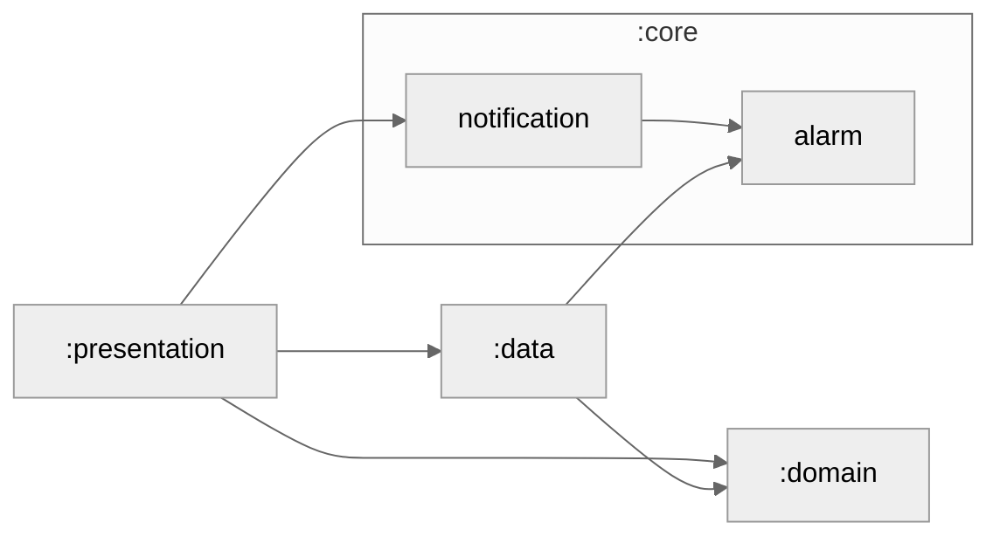

# Where-android

## Module Graph

## Test

### 알림 클릭한 경우

~~~shell
adb shell am start -n com.where.android/com.sooum.where_android.view.main.MainActivity \
    -a WHERE_ALARM_1 \
    --ei meetId 14
~~~

### 앱링크 로부터 들어온경우

~~~shell

~~~

### 스키마로부터 들어온경우

~~~shell

~~~