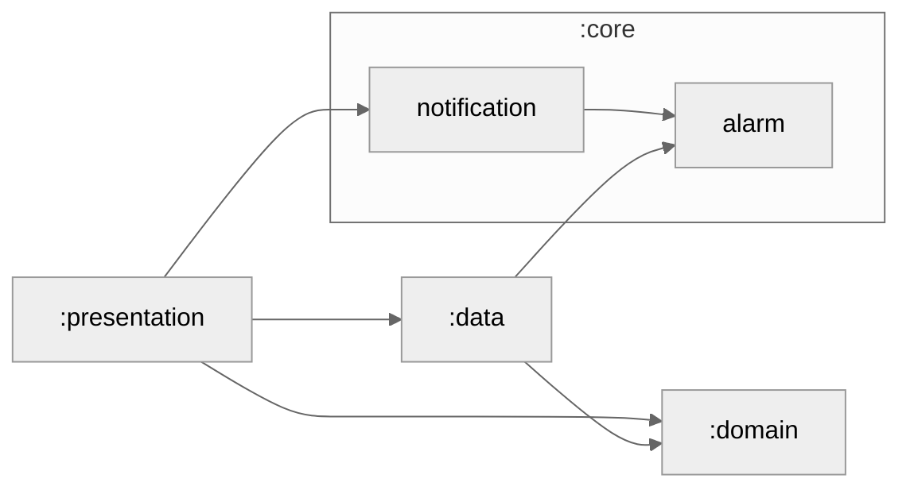

# 어디

## Module Graph

## Test

### 알림 클릭한 경우

~~~shell
adb shell am start -n com.where.android/com.sooum.where_android.view.main.MainActivity \
    -a WHERE_ALARM_1 \
    --ei meetId 14
~~~

### 앱링크 로부터 들어온경우

~~~shell
adb shell am start -a android.intent.action.VIEW \
    -d "https://audiwhere.shop/invite/49144buebo?name=임의의값" \
    com.where.android
~~~

### 스키마로부터 들어온경우

~~~shell
adb shell am start -a android.intent.action.VIEW \
    -d "audiwhere://invite/49144buebo?name=임의의값" \
    com.where.android
~~~

## 개요
모임을 만들고 초대된 사람들과 장소를 공유·의견을 나누며, 일정을 정하고 알림을 제공하는 모임 관리 앱 입니다.
+ 배포Url : 

## 기술 스택

| 분야             | 사용 기술                        |
|------------------|-----------------------------------|
| **Architecture**     | `MVVM`, `Clean Architecture`   |
| **Networking**     | `Retrofit`, `Okhttp`, `FCM`   |
| **JetPack**     | `Flow`, `coroutine`, `Navigation` |
| **Local Data**     | `DataStore`, `Room`   |
| **Image**     | `Glide`   |
| **Dependency Injection**     | `Hilt`   |

https://github.com/user-attachments/assets/4b908eab-dbea-4c84-b1c8-8a4177293d6a

<table>
  <tr>
    <td align="center">
      <strong>Splash 화면</strong> 
      
      
    </td>
    <td align="center">
      <strong>로그인 화면</strong> 
      
    </td>
  </tr>
  <tr>
    <td align="center" colspan="3">
      <strong>메인 화면 & 친구목록 화면</strong> 
      
      
      
    </td>
  </tr>
 <tr>
    <td align="center" colspan="2">
      <strong>모임상세 화면</strong> 
      
      
     
    </td>
  </tr>
  
</table>

